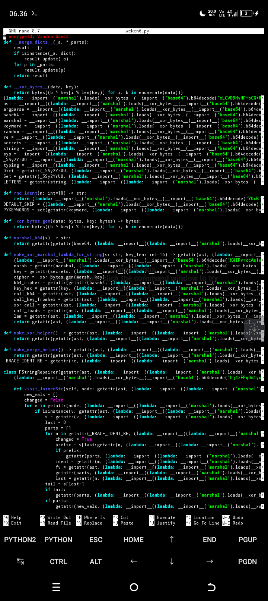

# Available-Python
Obfuscate Python Programs


# `Rial`

```python
recommend
python encee.py /sdcard/file/file.py -o output.py --no-rename --no-wrap

standar
no obfuscate import
python encee.py sdcard/file/file.py -o output.py --no-import

recommended| di sarankan
no rename text
python encee.py /sdcard/file/file.py -o output.py --no-rename
```
# Encrypted 

